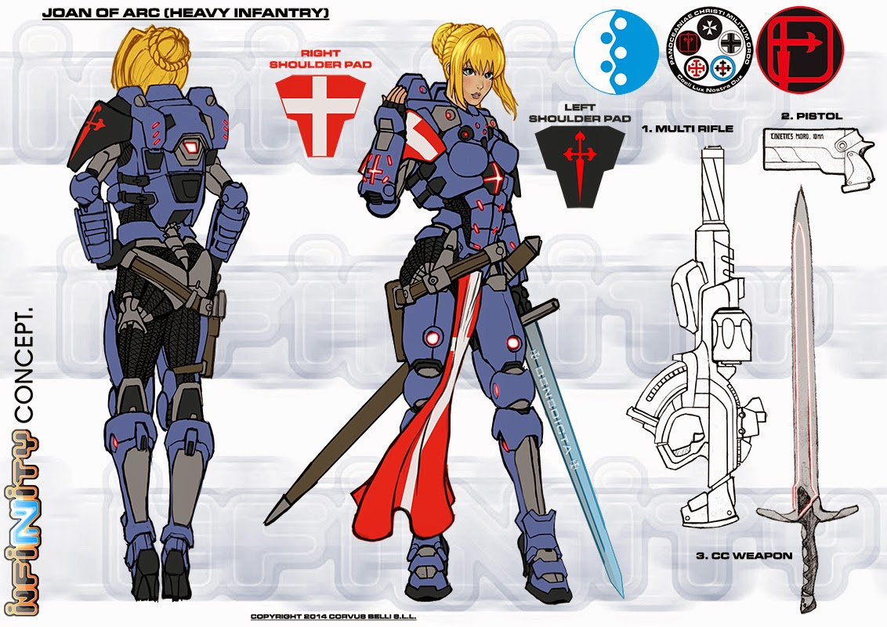

# Жанна д’Арк.

Жанна д’Арк(1412-1431) - французская героиня, причисленная к лику святых.
Глубоко религиозная, в возрасте тринадцати лет она внезапно стала слышать голоса,
которые воспринимала как божий знак для освобождения ее страны от английского господства.
В семнадцать лет она получила от дофина Франции небольшой контингент солдат,
который возглавляла в череде побед, возвестивших падение английских сил.
Она была взята в плен англичанами, обвинена в ереси и колдовстве и приговорена
Инквизицией к смерти через сожжение. Канонизирована Папой Римским в 1920.

Проект "Орлеанская дева" под эгидой ПанОкеании был нацелен на создание военного лидера,
способного воодушевить современных солдат на победы в самых тяжёлых сражениях.
Они нуждались в ком-то с необычайной харизмой, в ком-то, способном изменить ход боя чистой отвагой, пылом и рвением.
Аналитики ПанОкеании решили, что солдаты с христианским прошлым являются наиболее подходящими на роль такой фигуры.
Воссозданная Дева получила тактические способности, значительно превосходящие способности оригинала, а также широчайшую военно-религиозную подготовку в духе панокеанских военных орденов.
Когда обучение было завершено, она вошла в Орден Госпитальеров.
Она смогла продвинуться по службев ходе Blizzard Skirmishes против Ю Джинга в Свалархейме.
И к окончанию Неоколониальных войн (Joan of Arc уже была сестрой-офицером у рыцарей-госпитальеров) она была переведена в Орден Сантьяго для защиты маршрута Марс — Сатурн.
К концу этого периода службы Дева уже была живой легендой и служба с ней была источником гордости для солдат во всей панокеанской армии.
Она была назначена курировать оборону Неотерры, чтобы унять страхи населения, возникшие в ходе
неудачной аэрокосмической кампании на Линии Разграничения (Deviding Line).
Слухов о ее прибытии на передовую было достаточно, чтобы поднять боевой дух солдат
и воодушевить их на невероятные подвиги.
Под ее командованием солдаты сражались до последнего вздоха с беспрецедентной яростью,
храбростью и силой.
Ее присутствие в бою воспринималось как неоспоримое предзнаменование неизбежной победы.
Жанну описывали как помазанную Богом: ее глаза горят огнем, а голос подобен урагану.
Она воплощение абсолютных понятий о духе обаяния и могущества.
Как воина-хранителя всех панокеанских солдат, ей восхищаются все женщины и ее любят все мужчины.