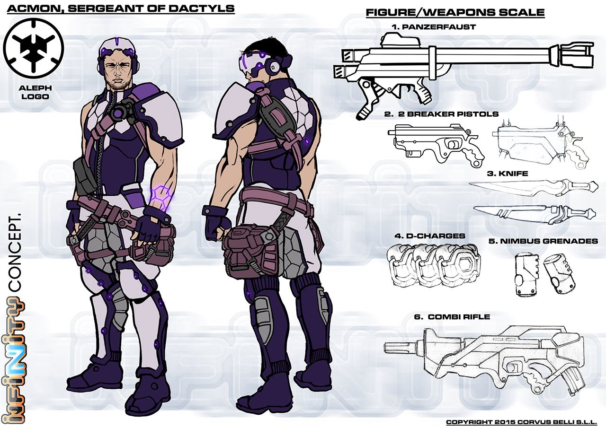

# Акмон.

Акмон (др.-греч. Ἄκμων). Ассоциируется с наковальней, в греческой мифологии он был одним из трех фригийских дактилей, обитавших на горе Ида и служивших фригийской Матери. Дактилям приписывалось открытие обработки железа. В «Энеиде» Вергилия, Акмон — сын Клитуса, одного из спутников Энея в его путешествии по Италии после падения Трои.

Заметки Аэда Тамирида для информационной службы С.С.С.: «Акмон — настоящий искусник по части взрывчатых веществ и разрушений, бесспорный мастер, одаренный особым талантом. И как любой творец имеет свои странности. Совсем небольшие странности. Знаете, все что его окружает, должно быть на своем месте, и его снаряжение и ваше, и он не задумываясь наведет порядок в ваших вещах, даже не спросив разрешения. Он перепроверяет дважды все, что делает. Постоянно моет руки, но никогда не носит перчаток. Его пальцы постоянно должны что-нибудь трогать, чтобы не потерять ни капли чувствительности. И по правде, вы должны обладать огромным терпением, чтобы находиться рядом с ним. Но если вы перестанете думать обо всем этом, он не покажется вам таким уж странным. Этот парень работает с чрезвычайно мощными взрывчатыми веществами, так что любая ошибка разорвет его в клочья. Если бы я должен был делать то, что делает он, то я тоже был бы одержим всем... благо это просто нелепость. Я никогда не сделаю ничего и вполовину столь же опасного как он».

Сейчас Акмон является войсковым инженером Гомеридов. И как инженер, он способен идеально починить все, что он захочет починить. Но герои фаланги больше любят его за умение уничтожать, в этой области он истинный мастер. К сожалению, этот талант вызывает некоторое нарушение равновесия, что в его случае проявляется как обсессивно-компульсивное расстройство личности. Тем не менее братья Гомериды признают и терпят его мании только потому, что он столь хорош в своем деле. И горе тому, кто ими пренебрегает. Ибо он скоро обнаружит, что Акмон пленен своими одержимостями очень серьезно. Подобное случилось с фузилёром Ангусом в ходе совместной операции. Он не желал уступить свое место за обеденным столом Акмону, третье место слева. То есть не желал до тех пор, пока не обнаружил приклеенный к своей груди взведенный подрывной заряд!

