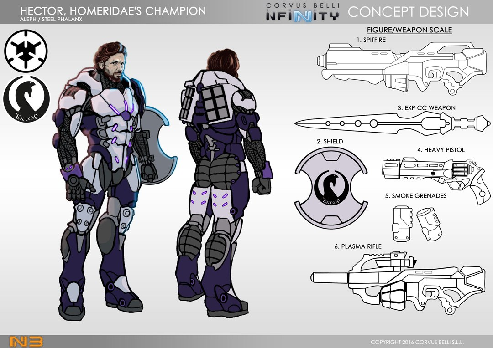

# Гектор.

Гектор – в древнегреческой мифологии сын царя Трои и военачальник троянского войска. Он был величайшим из всех троянских воинов и пал только лишь перед яростью Ахиллеса, его смерть знаменует собой завершение «Илиады».

Гектор противопоставляется Ахиллесу: невозмутимый герой, приверженец мира, при этом храбрый и готовый пожертвовать жизнью для защиты своего народа. В средневековье образ Гектора олицетворял истинный рыцарский идеал.

Заметки Аэда Тамирида для информационной службы С.С.С.: «Он двигался с головокружительной скоростью, бросаясь в атаку со всей своей мощью и при том уклоняясь от атак с мастерством, приобретенным за целую жизнь, посвященную войне. Броня делала пламя, заключенное в его теле, еще более могущественным и наделяла его необычайной силой и богоподобной скоростью. Он был ошеломителен. Опытом ветерана он чуял удары и взрывы еще до того, как они происходили. Он двигался со скоростью и яростью... Я даже не способен описать это... Я видел, как один человек победил целую армию. Несмотря на все это, самым удивительным было то, что в этой бесконечной битве он неустанно руководил войсками. Его ни с чем не сравнимые честь и отвага были именно тем, что нужно людям для сопротивления. Гектор никогда не сомневался. Он всегда знал, что нужно сделать, чтобы защитить личный состав фрегата, и его собственная жизнь выглядела небольшой ценой. Сколь невероятно важно было его безупречное, впечатляющее мужество. Насколько было бы все иначе, если его не было там, чтобы возглавить нас в битве. Без Гектора экипаж фрегата «Илиада» пал бы жертвой врагов. Но он знал, как вырвать победу у врага — победу, которая никогда не будет забыта.»

Сейчас Гектор второй человек в командовании Гомеридов. Никто не мог оспорить это назначение, ни в части его послужного списка, ни в части его личных навыков. То, как он ведет себя, его решительный взгляд, ярко выраженная уверенность в себе и внутренняя сила ковались от битвы к битве, словно он был древним воином вдали от своего дома. В то же время, его личное обаяние и разум в ходе планирования тактических операций подтолкнули его к деятельности, которая помогла заслужить позицию лидера Стальной Фаланги. Гектор способен мгновенно анализировать все возможные ситуации которые могут возникнуть на поле боя и совершенно безжалостен, когда наступает время сцепиться с врагом в схватке. Он настоящий солдат и стратег, в котором нуждается АЛЕФ, чтобы уничтожить EI.