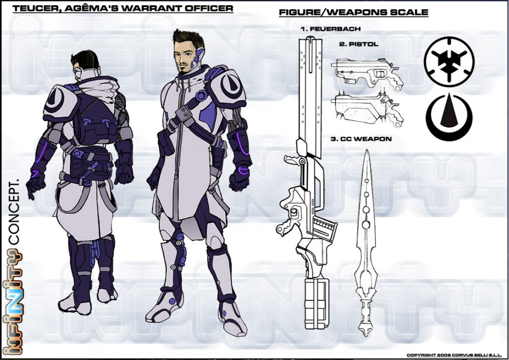

# Тевкр.

Тевкр (др.-греч. Τεῦκρος, лат. Teucer). В греческой мифологии — прославленный лучник. Он сражался бок о бок с Аяксом в Троянской войне и снискал славу великого стрелка, выпуская стрелы из-за гигантского щита своего единокровного брата. Тевкр был одним из тех афинян, кто укрывался внутри Троянского коня.

Заметки Аэда Тамирида для информационной службы С.С.С.: «Тевкр — неисправимый шутник в команде. Никто из нас не защищен от его колких острот, но его шутки и каламбуры неизменно приносят всеобщее веселье и радость. Однако он является бесценным членом Гомеридов за свой исключительный "коэффициент крутизны". Он способен, опередив врага занять боевую позицию и произнести нечто типа: "Лучший в мире снайпер на нашей стороне, и на каждом его микро-снаряде написано одно из ваших имен. И вы знаете как это бывает: немедленно сдавайтесь или умрите". Вам стоило бы увидеть, какое он делает при этом лицо. Это просто уморительно.»

Тевкр безудержный оптимист, в любой плохой ситуации указывающий на что-то хорошее, да так, что это гарантированно заставит тебя улыбнуться. Он один из самых молодых Гомеридов, и он находит все забавным, даже прозвище, которым его наградили товарищи по оружию — Тевкр (при создании ему присвоили кодовое обозначение Themistodres-09G). Соглашаясь с тем, что кодовое обозначение было труднопроизносимо, он воспользовался прозвищем, чтобы связать себя с Аяксом (своим мнимым единокровным братом) чем-то вроде приятельства. Аякс с этим молчаливо согласился и стал главной мишенью для острых как бритва насмешек Тевкра. "Голова садовая", "орангутан" и "деревенщина" — самые мягкие прозвища, которыми наградил Тевкр своего слоноподобного собрата. В ответ Аякс именует его "слизняком", "мелким прихвостнем" и множеством других эпитетов, которые лучше не упоминать, чтобы не расстраивать особо чувствительных. Но невзирая на злость их частых и жгучих подтруниваний, они верные друзья, и не задумываясь отдадут свои жизни, чтобы спасти друг друга. Бесстрашие и исключительная точность стрельбы позволили Тевкру занять место среди Гомеридов.

В бою он никогда не сомневается. Он никогда не думает дважды, просто выбирает наиболее серьезную угрозу и открывает огонь на поражение. Как и остальные Гомериды, он заявляет, что защищает Сферу от чужих, но на самом деле он занимается этим просто ради удовольствия. Нет ничего более желанного, чем оказаться на линии огня в непосредственном противостоянии с лучшим вражеским стрелком. Ничего более желанного, чем эйфория от превосходства над ними всеми: быстрый выстрел — лучший выстрел. Тевкр дуэлянт до мозга костей и не важно что сегодня у него в руках - опытный образец оружия или артиллерийская установка.

